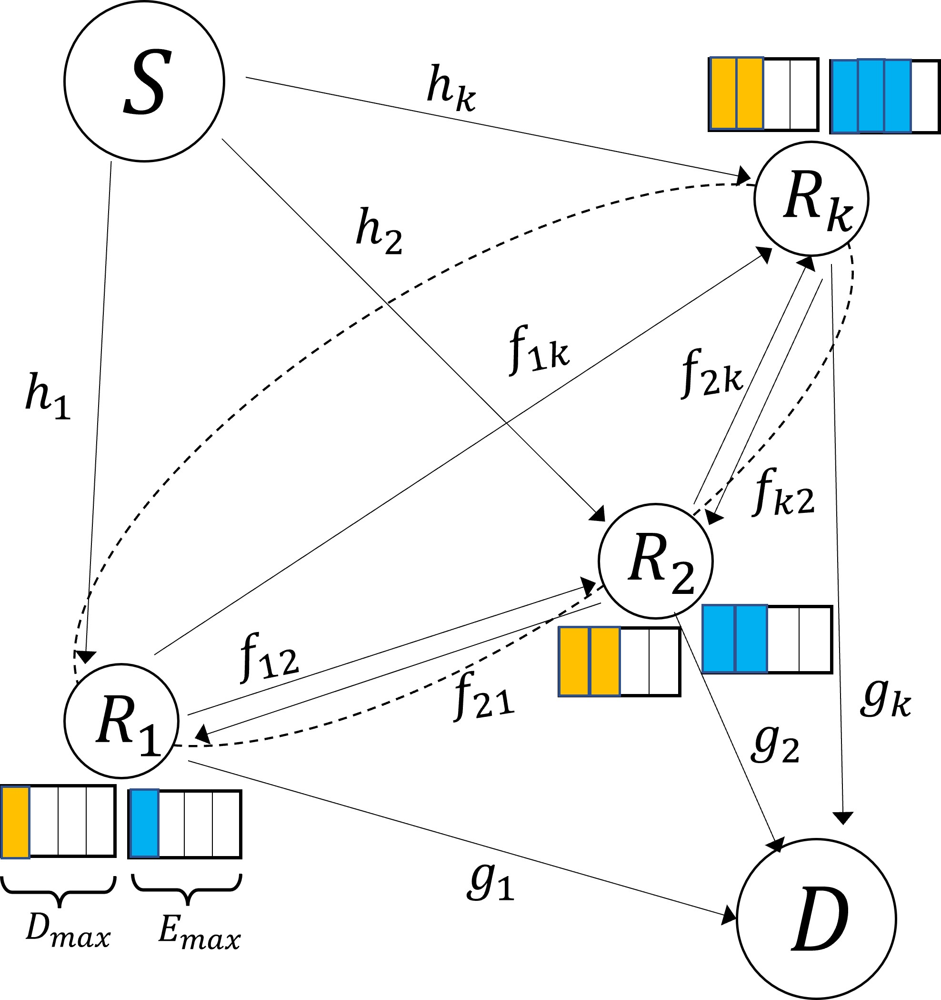

## This is the simulation code for Energy Prioritization Relay Selection (EPRS) Relay Selection Scheme
### Abstract
In internet of things (IoT) networks with IoT devices deployed for carrying out numerous environment monitoring tasks, the energy consumption for transmission needs to be low enough to prolong the lifetime of IoT devices. The low transmission power used by IoT devices restricts the effective communication range and thus a two-hop transmission via selected relays has been shown to achieve a good trade-off between extended communication range and undesired bandwidth penalty due to information repetition using multiple relays. In this work, we propose a relay selection scheme for buffer-aided relays that store the received signal in a finite data buffer and accumulate the energy harvested from RF signals in a finite energy storage. In the proposed scheme, relays are prioritized according to their instantaneous energy and data buffer status as well as channel conditions reported by relays. To render practical implementation, the anticipated cost of status update for relay selection that has been commonly ignored is explicitly considered. Besides, the energy accumulation rate is increased by utilizing both the source-relay and inter-relay channels to harvest energy. The performance of the proposed relay selection scheme is characterized by developing an analytical model based on the discrete-time Markov chain that tracks the evolution of data and energy buffers. Numerical results show the superiority of the proposed relay selection scheme than the state-of-art and elaborate the key factors that dominate the system performance.
### System Model
A two-hop communication scenario comprising of **K** relay nodes is performed in this simulation. The symbol **S** represents source, while **D** represents destination. The data packet should transmit by the intermediate relays **R<sub>1</sub>~R<sub>k</sub>** , which means the direct signal from source to destination is ignored. Besides, **h<sub>k</sub>** and **g<sub>k</sub>** denote the channel coefficients of 𝑆−𝑅<sub>k</sub> and 𝑅<sub>k</sub>−𝐷 links, respectively, and **f<sub>ij</sub>** is represented the channel coefficients between any two different relays R<sub>i</sub> and R<sub>j</sub>. All channel coefficients, namely h<sub>k</sub>,  g<sub>k</sub>, f<sub>ij</sub>, are assumed as i.i.d zero-mean complex Gaussian distribution. The figure is presented as follows.

In our work, each relay maintains two finite buffers, including a data buffer, which can keep at most **D<sub>max</sub>** data packets, and an energy buffer, whose maximum storage is **E<sub>max</sub>** intervals. An interval in the energy buffer corresponds to the amount of energy consumed to transmit one data packet, which has a fixed length.

<center>

</center>

### How to run the code?
```
git clone https://github.com/Sinyu104/EPRS-Relay-Selection-Scheme.git
```

### About the code
At first, a range of SNR, the number of relays, energy size, and data size should be in the **class of global variable**, which contains all the system coefficients. Then, in **main** function, it would create the class object of relays and performed EPRS algorithm in different SNR. We can set the number of testing bits in the global variable. For low SNR, lower testing bits is used in the system to save time. Conversely, for high SNR, it requires more testing bits to make the result accurate since the outage probability is much lower than the one in low SNR. In the system, the most important part is the receiving and transmitting algorithm, which is coded in those two function **SelectRecei** and **SelectTrans**. 

- Receiving Algorithm (SelectRecei)

    In this function, four sets has been allocated, such as **RS**, **minchargeeff**, **mindatarly**, **maxengrly**. The defination of RS is , where $\gamma_{h_k}$ denotes the SNR in $S-R_k$ side. Then, we first prioritize the relays in RS according to their residual charging space defined as $\phi_k = \min( \epsilon_k+E_k, E_{\max}) - \epsilon_k$. We would put the relays with minimum $\phi$ into the set *minchargeeff*. After that, the relays with shortest data length would be assigned into *mindatarly*. The relays with longest energy buffer would be assigned into set *maxengrly*. 
   
- Transmitting Algorithm (SelectTrans)

    Similarly, three sets is used in these function, such as **TS**, **maxdatarly**, **maxengrly**. The defination of TS is $\mathcal{TS}=\lbrace R_{k} \in \tilde{\mathcal{R}} \vert\gamma_{g_k} \geq \gamma_{\text{th}} \rbrace$, where $\gamma_{g_k}$ denotes the SNR in $R_k-D$ side. Then, the relays with maximum data length is prioritized for transmission. Therefore, we would select the relays in TS with maximum data length into another set *maxdatarly*. Lastly, the relays with maximum energy length in *maxdatarly* is putted into set *maxengrly*. We would choose the best transmission relay from *maxengrly* by uniform probability. 

